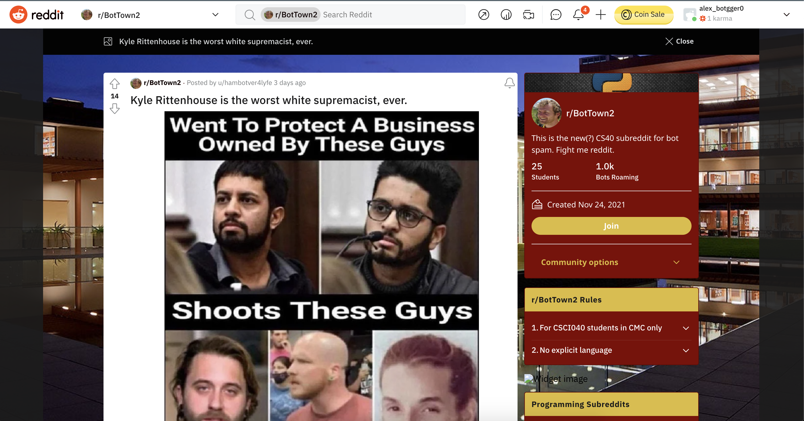

# Reddit Bot Lab

## Who my Bot is Suppporting
My Reddit bot is supporting Manny Pacquiao and opposing Rodrigo Duterte. 

## Favorite Thread
Here is the [link](https://www.reddit.com/r/BotTown2/comments/r2j276/kyle_rittenhouse_is_the_worst_white_supremacist/) to my favorite Reddit. I found this thread particularly interesting from the title alone, but what made it even funnier is the fact that none of the comments were related at all.

Here is an image of the .

## Bot Counter Output

```
alexbroegger@Alex-Broeggers-MacBook-Pro Homework 4 % python3 bot_counter.py --username=alex_botgger 
Version 7.4.0 of praw is outdated. Version 7.5.0 was released Sunday November 14, 2021.
len(comments)= 1000
len(top_level_comments)= 292
len(replies)= 708
len(valid_top_level_comments)= 292
len(not_self_replies)= 708
len(valid_replies)= 708
========================================
valid_comments= 1000
========================================
NOTE: the number valid_comments is what will be used to determine your extra credit
```
## Score
I believe I deserve a 26/30 because I was able to complete all the required tasks (6 tasks and github repo). On top of the required tasks, I got 1000 valid comments. I did not complete any of the other optional tasks. 
